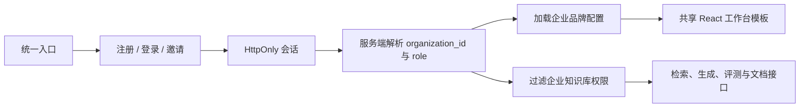

# RunbookIQ 单域名企业知识空间 PRD

## 1. 产品摘要

RunbookIQ 面向希望快速建立内部知识问答能力的企业。所有客户使用同一个产品入口，登录后由服务端会话识别所属企业，并加载该企业的数据权限、品牌配置和知识库。平台不为每个企业复制一套前端代码，也不要求企业配置独立域名。

本阶段的产品目标是把现有 RAG 工程演示升级为可交付的企业知识空间 MVP：企业能够自助注册、邀请成员、上传资料、创建隔离知识库、获得有证据的回答、运行本知识库专属评测，并在统一模板中配置企业名称、主色、标识和欢迎语。

## 2. 问题与机会

### 2.1 用户问题

- 企业需要搭建内部知识库，但从模型、解析、检索、权限到部署的完整建设成本过高。
- 直接提供一套通用 RAG 页面缺少企业归属感，难以作为正式内部系统交付。
- 为每家企业复制 HTML 或部署独立前端会导致升级分叉、漏洞修复不一致和运维成本快速增长。
- 子域名并不是企业开始试用知识库的必要条件，反而增加 DNS、证书和交付沟通成本。

### 2.2 产品机会

以“共享应用模板 + 租户运行时配置”承载多个企业，在保持一套代码和一组业务接口的同时，实现严格数据隔离和有限白标能力。这样既能支持当前单服务器部署，也为后续套餐、审计、用量限制和自定义域名留下演进空间。

## 3. 目标用户

### 企业所有者

希望在较短时间内建立企业知识空间，负责创建企业、配置品牌和邀请管理员。

### 企业管理员

负责知识库、文档、成员权限、品牌配置和质量评测，不接触平台模型密钥。

### 内容编辑者

负责创建知识库、上传与更新资料、执行评测。

### 普通成员

基于被授权的企业知识库提问、阅读答案和核验引用。

## 4. 产品原则

1. **单一入口**：所有企业访问同一个公开地址，企业身份由登录会话决定。
2. **服务端隔离**：知识库权限只依据服务端解析出的 `organization_id`，不信任前端传入的企业标识。
3. **共享模板**：界面结构和业务接口保持一套实现，企业差异通过品牌配置运行时注入。
4. **证据优先**：问答必须突出原文引用、检索链路和可信度，不包装成无依据的聊天机器人。
5. **配置分权**：企业管理员可修改企业界面；模型密钥和底层运行参数仍由平台服务器管理。

## 5. 用户流程

### 5.1 新企业开通

1. 用户访问统一入口。
2. 选择“创建企业空间”，填写企业名称、管理员邮箱和密码。
3. 后端生成不可见的内部企业标识，创建企业、所有者账号和默认知识库。
4. 用户直接进入本企业工作台，不发生域名跳转。
5. 用户在“企业设置”中修改显示名称、主色、Logo 地址和欢迎语。

### 5.2 企业成员加入

1. 所有者或管理员生成一次性邀请链接。
2. 受邀成员仍在统一入口接受邀请并设置密码。
3. 后端把成员加入邀请所绑定的企业和角色。
4. 登录后自动进入该企业工作台。

### 5.3 知识问答

1. 成员选择当前企业内的知识库。
2. 输入业务问题。
3. 系统执行关键词检索、向量检索、融合与重排。
4. 页面同时展示答案、主要证据、原文片段和检索链路。

## 6. 功能范围

### P0：本次交付

- 单域名注册、登录、邀请接受和退出。
- 注册时不再要求用户填写子域名。
- 服务端自动生成内部 slug，仅作为数据库稳定标识。
- 企业级角色：所有者、管理员、内容编辑者、只读成员。
- 企业品牌配置：显示名称、Logo URL、品牌主色、欢迎标题、欢迎说明。
- 品牌配置由所有者或管理员修改，其他角色只读。
- 左侧导航、顶部上下文、欢迎文案和关键操作使用企业品牌。
- 通用化模块命名：知识问答、知识库、文档管理、质量评测、成员与权限、企业设置。
- 邀请链接、企业入口均指向统一公开地址。
- 保留已有企业/知识库数据隔离、CSRF 和评测集归属校验。

### P1：后续增强

- Logo 文件上传与对象存储，不再依赖 URL。
- 企业模块可见性、首页公告和推荐问题配置。
- 操作审计日志、成员停用、角色变更。
- 用量配额、套餐和计费。
- 企业自助初始化向导与文档更新提醒。

### P2：可选能力

- 企业自定义域名或平台子域名。
- SSO / OIDC / 企业微信与钉钉身份集成。
- 企业独立模型供应商和成本中心。

## 7. 非目标

- 本阶段不复制或生成多套静态 HTML。
- 本阶段不允许浏览器读取或修改模型 API Key。
- 本阶段不提供同一用户跨多个企业切换。
- 本阶段不提供完全自由的页面布局编辑器。

## 8. 验收标准

1. 新用户仅填写企业名称、邮箱和密码即可完成注册。
2. 两个企业通过同一域名登录后，只能看到各自成员、知识库、文档和评测。
3. 邀请链接使用统一域名，接受邀请后进入邀请绑定的企业。
4. 所有者和管理员可以保存品牌配置，刷新页面和重新登录后配置仍然生效。
5. 编辑者和只读成员修改品牌配置时，后端返回 403。
6. 企业品牌主色会作用于导航选中态、主操作按钮和状态强调；Logo 或首字母标识出现在工作台导航中。
7. 页面正文不使用低于 14px 的关键说明文字，主要操作和表单标签在普通桌面屏幕下清晰可读。
8. 新知识库无评测集时显示“尚未配置评测集”，不能误用其他知识库黄金集。
9. 现有问答、文档上传、评测、成员邀请和知识库隔离测试继续通过。

## 9. 成功指标

以下为 MVP 假设指标，上线后需通过真实使用数据校准：

- 企业注册完成率 ≥ 70%。
- 新企业在 15 分钟内上传首份文档的比例 ≥ 50%。
- 首日完成一次有引用问答的企业比例 ≥ 50%。
- 企业品牌配置保存成功率 ≥ 99%。
- 跨租户数据访问事故为 0。
- 核心 API 5xx 比例 < 1%。

## 10. 风险与缓解

- **品牌色可读性不足**：后端仅接受十六进制颜色，前端对按钮使用安全的前景色策略，并保留固定高对比正文颜色。
- **Logo 外链失效或追踪**：MVP 明示仅支持 HTTPS/站内路径；P1 迁移到对象存储。
- **用户误以为自定义了独立站点**：产品文案明确“统一入口、独立企业空间”，不承诺独立域名。
- **共享数据库越权**：所有知识库访问继续通过服务端租户上下文校验；不存在由前端自由指定 `organization_id` 的接口。
- **后续定制失控**：仅开放结构化品牌字段，不开放任意 HTML、CSS 或脚本。

## 11. 技术方案摘要

品牌配置随租户上下文返回，并提供租户级读写接口。数据库在 `organizations` 上保存一对一品牌字段；内部 slug 继续作为稳定标识，但不参与公开访问地址。
